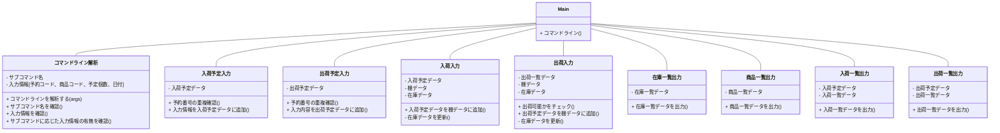

# 詳細設計書  

## ・仕様説明
### 商品の入荷から出荷を管理するコマンドラインツールを作成する。

## ・仕様要件
 1. コマンドラインからサブコマンドを指定されて動作する
 2. データはデータベースを用いて管理する
 3. 商品は棚に格納されて管理されているものとする
 4. 機能は以下の通りとする。
    1. 入荷予定入力  
        - 入荷予定データを入力する。（予約コード、商品コード・入荷予定個数、入荷予定日）
    2. 入荷入力  
        - 入荷予定データから、入荷情報を棚データに登録、在庫データに反映させる
    3. 出荷予定入力  
        - 出荷予定データを入力する。（予約コード、商品コード・出荷予定個数、出荷予定日）
    4. 出荷入力  
        - 出荷予定データから、出荷情報を棚データ、在庫データに反映させる。
    5. 在庫一覧入力  
        - 棚データから、在庫一覧を出力する。
    6. 商品一覧入力  
        - 商品ごとの、入荷予定、出荷予定、在庫数、引き当て可能数の一覧情報を出力する。
    7. 入荷一覧出力  
       - 入荷予定一覧を出力する。
    8. 出荷一覧出力  
        - 出荷予定一覧を出力する。  
## ・要件説明
**1.テーブル定義**  
- マスターデータ
  - 商品マスタ 商品データのマスタ情報
  
- 管理データ
  - 棚データ 棚ごとの格納情報
  - 在庫データ 商品ごとの在庫数データ
- 出力データ
  - 在庫一覧データ 在庫状況の一覧出力用
  - 商品一覧データ 商品ごとの一覧出力用
  - 入荷一覧データ 入荷状況の一覧出力用
  - 出荷一覧データ 出荷状況の一覧出力用
- 予定データ
  - 入荷予定データ 入荷予定の一覧出力用
  - 出荷予定データ 出荷予定の一覧出力用

**2.テーブル詳細(※カッコ内はテーブル名)**  
- マスターデータ
  - 商品マスタ(master)
    - 商品コード、商品名
- 管理データ
  - 棚データ(rack)
    - 棚番号、商品コード、商品数、入荷日、出荷日
  - 在庫データ(stock)
    - 商品コード、在庫数
- 出力データ
  - 在庫一覧データ (stocklist)
    - 棚番号、商品名、商品数
  - 商品一覧データ (itemlist)
    - 商品コード、商品名、入荷予定数、出荷予定数、在庫数、引当可能数
  - 入荷一覧データ (inputlist)
    - 商品コード、入荷予定数、入荷予定日、予約コード(8桁の数字)、入荷ステータス(入荷待ち:0/入荷済み:1)
  - 出荷一覧データ (outputlist)
    - 商品コード、出荷予定数、出荷予定日、予約コード(8桁の数字)、出荷ステータス (出荷待ち:0/出荷済み:1)
- 予定データ
  - 入荷予定データ (inputplan)  
    - 商品コード、入荷予定数、入荷予定日、予約コード、入荷ステータス
  - 出荷予定データ (outputplan)  
    - 商品コード、出荷予定数、出荷予定日、予約コード、出荷ステータス
  
  (※予約コード、商品コード、(入荷/出荷)予定個数、(入荷/出荷)予定日をまとめて**入力情報**とする。)
  
  **3.機能ごとのコマンドライン(※プロジェクト名:kadai2)**
    1. 入荷予定入力 *(サブコマンド名:inputplan)*
       - -java kadai2 inputplan (予約コード) (商品コード) (入荷予定数) (入荷予定日)   
         (必要テーブル:inputplan) 
    2. 入荷入力  *(サブコマンド名:inputdata)*
       - -java kadai2 inputdata (予約コード)  
        （必要テーブル:inputplan,rack,stock）
    3. 出荷予定入力  *(サブコマンド名:outputplan)*  
       - -java kadai2 outputplan (予約コード) (商品コード) (出荷予定数) (出荷予定日)   
        （必要テーブル:outputplan）
    4. 出荷入力  *(サブコマンド名:outputdata)*  
       - -java kadai2 outputdata (予約コード)  
        （必要テーブル:outputplan,rack,stock）
    5. 在庫一覧出力    *(サブコマンド名:stock)* 
       - -java kadai2 stock  
        （必要テーブル:stock）
    6. 商品一覧出力    *(サブコマンド名:item)*
       - -java kadai2 item  
        （必要テーブル:itemlist）
    7. 入荷一覧出力    *(サブコマンド名:inputview)*
       - -java kadai2 inputview (商品コード)   
        （必要テーブル:inputplan,inputlist）
    8. 出荷一覧出力    *(サブコマンド名:outputview)*
       - -java kadai2 outputview (商品コード)  
        （必要テーブル:outputplan,outputlist）  
  
  **4.クラス詳細**

(図1)クラス図の概要

1. **Mainクラス**   
   1. コマンドラインからサブコマンドを読み込む。パラメータの1つ目がサブコマンド、2つ目以降は入力情報である。  
    この際にサブコマンドが指定されなければエラー処理をしてプログラムを終了する。

   2. `コマンドライン解析クラス`でコマンドラインの整合性の確認を行う。  

   3. サブコマンドが"入荷予定入力"の場合は、`入荷予定入力クラス`で入力情報を入荷予定データに反映させる。  
   4. サブコマンドが"出荷予定入力"の場合は、`入荷予定入力クラス`で入力情報を出荷予定データに反映させる。
   
   5. サブコマンドが"入荷入力"の場合は、`入荷入力クラス`で入荷予定データの内容を棚データに反映させて、在庫データの更新を行う。
     
   6. サブコマンドが"出荷入力"の場合は、`出荷入力クラス`で出荷予定データの内容を棚データに反映させて、在庫データの更新を行う。
     
   7. サブコマンドが"在庫一覧出力"の場合は、`在庫一覧出力クラス`で在庫一覧データの出力を行う。   
   
   8. サブコマンドが"商品一覧出力"の場合は、`商品一覧出力クラス`で商品一覧データの出力を行う。  
   
   9. サブコマンドが"入荷一覧出力"の場合は、`入荷一覧出力クラス`で入荷一覧データの出力を行う。  
   
   10. サブコマンドが"出荷一覧出力"の場合は、`出荷一覧出力クラス`で出荷一覧データの出力を行う。 
   
2. **コマンドライン解析クラス** *(クラス名:ReadCommandline)*   
   引数は**パラメータ**。  
      1. パラメータの内容をサブコマンドと入力情報に分ける。  
      2. サブコマンドの確認をする。  
      3. 入力内容の形式を確認する。
      4. サブコマンド実行に必要な入力内容の有無を確認する。
   
3. **入荷予定入力クラス** *(クラス名:Inputplan)*  
   引数は**入力情報**。  
      1. 入荷予定データを読み込む。  
      2. 予約コードが既に使用されているか確認する。使用されていた場合はエラー処理を行う。  
      3. 予約コード、商品コード、入荷予定数、入荷予定日を入荷予定データに反映させて、入荷ステータスを設定する。  
      
4. **出荷予定入力クラス** *(クラス名:Outputplan)*  
   引数は**入力情報**。  
      1. 出荷予定データを読み込む。  
      2. 予約コードが既に使用されているか確認する。使用されていた場合はエラー処理を行う。  
      3. 予約コード、商品コード、出荷予定数、出荷予定日を出荷予定データに反映させて、出荷ステータスを設定する。
   
5. **入荷入力クラス**  *(クラス名:Inputdata)*  
   引数は**入力情報**。  
    1. 入荷予定データ、棚データ、在庫データを読み込む。  
    2. 予約コードに応じた入荷一覧データを棚データに反映させてから、入荷ステータスを切り替える。  
    この時指定した予約コードが存在しない場合や、既に入荷済みの場合はエラー処理を行う。  
    3. 在庫データを更新する。
 
6. **出荷入力クラス**  *(クラス名:Outputdata)*  
   引数は**入力情報**。  
    1. 出荷予定データ、棚データ、在庫データを読み込む。
    2. 予約コードに応じた出荷予定データを棚データに反映させてから、出荷ステータスを切り替える。  
    この時指定した予約コードが存在しない場合や、既に出荷済みの場合、  
    あるいは商品がない、または在庫がないなどで出荷予定データの内容が実行できない場合はエラー処理を行う。  
    3. 在庫データを更新する。    

7. **在庫一覧出力クラス** *(クラス名:Stockview)*  
   引数はなし。  
    1. 在庫一覧データを読み込む。  
    2. 読み込んだデータ内容を出力する。  

8. **商品一覧出力クラス** *(クラス名:Itemview)*  
   引数はなし。  
    1. 商品一覧データを読み込む。  
    2. 読み込んだデータ内容を出力する。  

9.  **入荷一覧出力クラス** *(クラス名:Inputview)*  
   引数は**入力情報**。  
    1. 入荷予定データを読み込む。
    2. 入荷一覧データの内容をリセットする。  
    3. 商品コードが指定されていたら指定された商品の入荷予定データの内容を入荷一覧データに追加する。  
    指定されていなければすべての商品の入荷予定データの内容を入荷一覧データに追加する。  
    合致するデータがない場合はエラー処理を行う。
    4. 入荷一覧データを出力する。  

10. **出荷一覧出力クラス** *(クラス名:Outputview)*  
   引数は**入力情報**。  
    1. 出荷予定データを読み込む。  
    2. 出荷一覧データの内容をリセットする。  
    3. 商品コードが指定されていたら指定された商品の出荷予定データの内容を出荷一覧データに追加する。  
    指定されていなければすべての商品の出荷予定データの内容を出荷一覧データに追加する。  
    合致するデータがない場合はエラー処理を行う。
    4. 出荷一覧データを出力する。   
