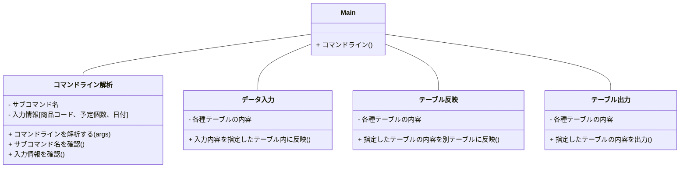

# 詳細設計書  

## ・仕様説明
### 商品の入荷から出荷を管理するコマンドラインツールを作成する。

## ・仕様要件
 1. コマンドラインからサブコマンドを指定されて動作する
 2. データはデータベースを用いて管理する
 3. 商品は棚に格納されて管理されているものとする
 4. 機能は以下の通りとする。
    1. 入荷予定入力  
        - 入荷予定データを入力する。（商品コード・入荷予定個数、入荷予定日）
    2. 入荷入力  
        - 入荷予定データから、入荷情報を棚データに登録、在庫データに反映させる
    3. 出荷予定入力  
        - 出荷予定データを入力する。（商品コード・出荷予定個数、出荷予定日）
    4. 出荷入力  
        - 出荷予定データから、出荷情報を棚データ、在庫データに反映させる。
    5. 在庫一覧入力  
        - 棚データから、在庫一覧を出力する。
    6. 商品一覧入力  
        - 商品ごとの、入荷予定、出荷予定、在庫数、引き当て可能数の一覧情報を出力する。
    7. 入荷一覧出力  
       - 入荷予定一覧を出力する。
    8. 出荷一覧出力  
        - 出荷予定一覧を出力する。  
## ・要件説明
**1.テーブル定義**  
- マスターデータ
  - 商品マスタ　商品データのマスタ情報
  
- 管理データ
  - 棚データ　棚ごとの格納情報
  - 在庫データ　商品ごとの在庫数データ
- 出力データ
  - 在庫一覧データ　在庫状況の一覧出力用
  - 商品一覧データ　商品ごとの一覧出力用
  - 入荷一覧データ　商品ごとの一覧出力用
  - 出荷一覧データ　出荷状況の一覧出力用

**2.テーブル詳細(※カッコ内はテーブル名)**  
- マスターデータ
  - 商品マスタ(master)
    - 商品コード、商品名
- 管理データ
  - 棚データ(rack)
    - 棚番号、商品コード、商品数、入荷日、出荷日
  - 在庫データ(stock)
    - 商品コード、在庫数
- 出力データ
  - 在庫一覧データ (stocklist)
    - 棚番号、商品名、商品数
  - 商品一覧データ (itemlist)
    - 商品コード、商品名、入荷予定数、出荷予定数、在庫数、引当可能数
  - 入荷一覧データ (inputlist)
    - 商品コード、入荷予定数、入荷予定日、予約コード(8桁の数字)、ステータス
  - 出荷一覧データ (outputlist)
    - 商品コード、出荷予定数、出荷予定日、予約コード(8桁の数字)、ステータス
  
  (※商品コード、(入荷/出荷)予定個数、(入荷/出荷)予定日、予約コードをまとめて**入力情報**とする。)
  
  **3.機能ごとのコマンドライン(※プロジェクト名：kadai2)**
    1. 入荷予定入力 (サブコマンド名:inputplan) 
       - -java kadai2 inputplan (商品コード) (入荷予定数) (入荷予定日)  
         (必要テーブル:inputlist) 
    2. 入荷入力  (サブコマンド名:datainput)
       - -java kadai2 datainput (予約コード)  
        （必要テーブル:inputlist,rack,stock）
    3. 出荷予定入力  (サブコマンド名:outputplan)  
       - -java kadai2 outputplan (商品コード) (出荷予定数) (出荷予定日)  
        （必要テーブル:outputlist）
    4. 出荷入力  (サブコマンド名:dataoutput)  
       - -java kadai2 dataoutput (予約コード)  
        （必要テーブル:outputlist,rack,stock）
    5. 在庫一覧出力    (サブコマンド名:stock) 
       - -java kadai2 stock  
        （必要テーブル:stock）
    6. 商品一覧出力    (サブコマンド名:item)
       - -java kadai2 item  
        （必要テーブル:itemlist）
    7. 入荷一覧出力    (サブコマンド名:inputview)
       - -java kadai2 inputview  
        （必要テーブル:inputlist）
    8. 出荷一覧出力    (サブコマンド名:outputview)
       - -java kadai2 outputview  
        （必要テーブル:outputlist）  
  
  **4.クラス詳細**

(図1)クラス図の概要

1. **Mainクラス**   
   1. コマンドラインからサブコマンドを読み込む。パラメータの1つ目がサブコマンド、2つ目は商品コード、3つ目が(入荷/出荷)予定個数、4つ目が(入荷/出荷)予定数である。  
    この際にサブコマンド、(入荷/出荷予定入力時に)商品コード、予定個数、日付が指定されなければエラー処理をしてプログラムを終了する。

   2. `コマンドライン解析クラス`でコマンドラインの整合性の確認を行う。  

   3. サブコマンドが"入荷予定入力"か"出荷予定出力"の場合は、`データ入力クラス`で入力情報をテーブルに反映させる。  
   4. サブコマンドが"入荷入力"か"出荷入力"の場合は、`テーブル反映クラス`で各種テーブルの反映を行う。  
   5. 3.4.以外のサブコマンドの場合は、`テーブル出力クラス`でテーブル内容の出力を行う。  
   
2. **コマンドライン解析クラス** *(クラス名:ReadCommandline)*   
   引数は**パラメータ**。  
      1. パラメータの内容をサブコマンドと入力情報に分ける。  
      2. サブコマンドの確認をする。  
      3. 入力内容の形式を確認する。
   
3. **データ入力クラス** *(クラス名:Datainput)*  
   引数は**入力情報**。  
      1. 必要なテーブルを準備する。  
      2.   

4. **テーブル反映クラス**  *(クラス名:Tableupdate)*  
   引数は**予約コード**。  
    1. 必要なテーブルを準備する。  
    2. サブコマンドが"入荷入力"の場合は、予約コードに入荷一覧データを棚データに反映させる。この時指定した予約コードが存在しない場合はエラー処理を行う。
    3. サブコマンドが"出荷入力"の場合は、出荷一覧データを棚データに反映させる。この時指定した予約コードが存在しない場合、あるいは出荷一覧データの内容で実行できない(商品がない、または在庫がないなど)場合はエラー処理を行う。  
 5. **テーブル出力クラス** 